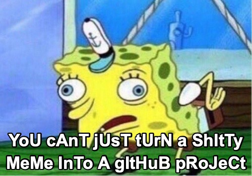

# SPoNgEBoB

[](https://github.com/calini/spongebob/actions/workflows/ci.yml)
[](https://github.com/calini/spongebob/releases/latest)
[](https://goreportcard.com/report/github.com/calini/spongebob)
[](LICENSE.md)

Simple project for converting normal text to sPonGeBOb tExT

<p align="center">
  
</p>

It uses _CUTTING EDGE_ technology like *MARKOV CHAINS™* to generate _REALISTIC_ SPonGeBoBⓇ text.️

## Getting it

### Homebrew

```sh
brew install calini/tap/spongebob
```

### Go

```sh
go install github.com/calini/spongebob/cmd/spongebob@latest
```

## Using the CLI

```sh
spongebob "hello world"
> hELlO wOrlD
```

## Building it manually
```sh
go build -o ./spongebob ./cmd/spongebob

./spongebob "hello world"
> hELlO wOrlD
```

## Using it as a library
```go
package main

import (
	"fmt"

	"github.com/calini/spongebob"
)

func main() {
    fmt.Println(spongebob.Text("Hello world!"))
}
```
